# linux-demo-repo

Demo project for linux

## Level 1 – Basic (Foundational Skills)

- Set up users, groups for dev team

``` bash
sudo groupadd devteam
sudo useradd -m -G devteam alice
sudo useradd -m -G devteam bob
sudo passwd alice
sudo passwd bob
```

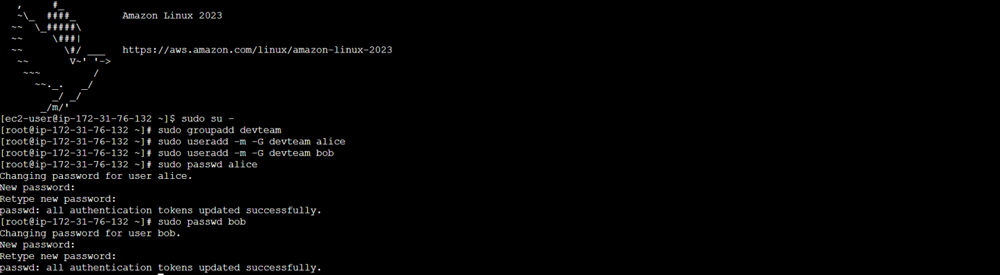

-  Manage permissions for project directories

``` bash
sudo mkdir -p /opt/myapp
sudo chown :devteam /opt/myapp
sudo chmod 770 /opt/myapp
```
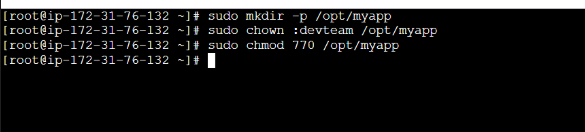

- Install required packages (git, nginx, java)

``` bash
sudo apt update -y (or) sudo yum update -y
sudo yum install -y java-17-amazon-corretto
```
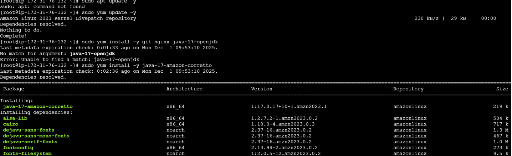

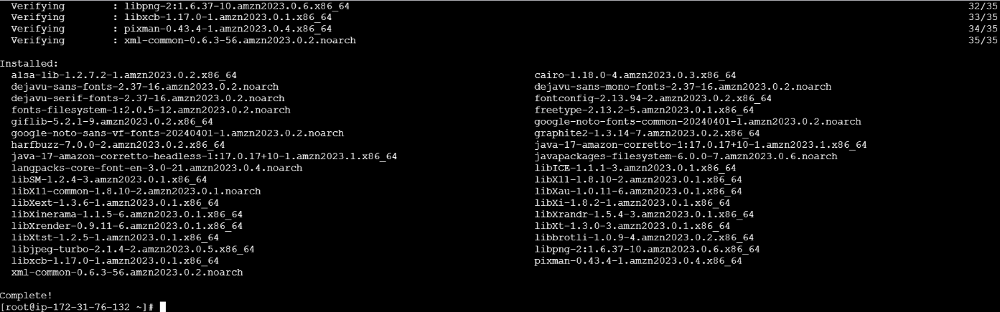

- Check system info (memory, CPU, disks)

``` bash
free -h
lscpu
df -h
lsblk
```

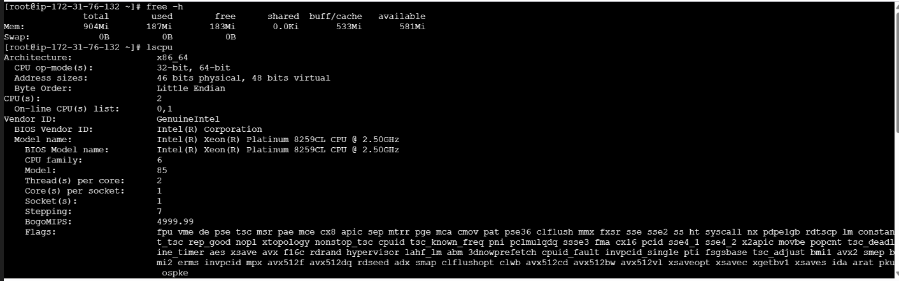


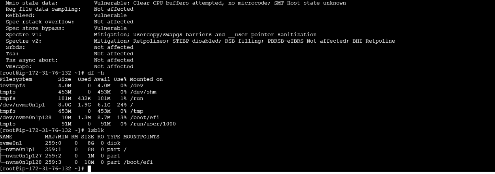


## Level 2 – Intermediate (Daily DevOps Tasks)

- Automate backups with Cron

``` bash
Explain: “Create a daily backup of /opt/myapp to /backup folder.”

Commands:
sudo mkdir -p /backup
echo "sudo cp -r /opt/myapp /backup/myapp-$(date +%F)" >> /usr/local/bin/backup.sh
sudo chmod +x /usr/local/bin/backup.sh
sudo crontab -e [sudo yum install -y cronie,sudo systemctl enable crond sudo systemctl start crond
]
Add cron line:
0 2 * * * /usr/local/bin/backup.sh
```

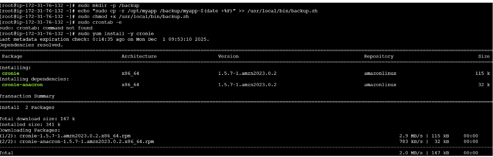

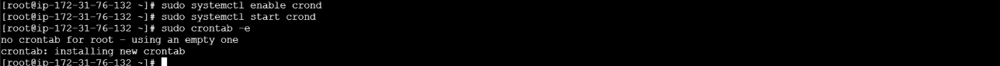

- Create shell scripts: Log cleanup, service restart, health checks

``` bash

1 Log Cleanup Script
sudo nano /usr/local/bin/clean_logs.sh
Paste:
#!/bin/bash
find /var/log -type f -name "*.log" -mtime +7 -exec rm -f {} \;
Make executable:
sudo chmod +x /usr/local/bin/clean_logs.sh
2 Service Restart Script
sudo nano /usr/local/bin/restart_nginx.sh
Paste:
#!/bin/bash
sudo systemctl restart nginx
Make executable: sudo chmod +x /usr/local/bin/restart_nginx.sh
3 Health Check Script
sudo nano /usr/local/bin/check_service.sh
Content:#!/bin/bash
systemctl is-active nginx || systemctl restart nginx
```
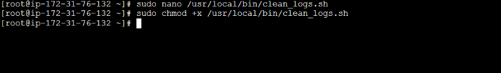

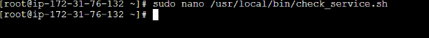

- Manage logs under /var/log

``` bash
Run: ls -lh /var/log
tail -f /var/log/syslog(or)journalctl -f
```

- Monitor system performance and troubleshoot services

``` bash
Explain commonly used commands:
CPU + Memory: 
top
htop     # if installed
Specific process check: 
ps aux | grep nginx
Network Troubleshooting:
ss -tulnp
ping google.com
traceroute google.com
Service Troubleshooting: 
systemctl status nginx
journalctl -xe
```
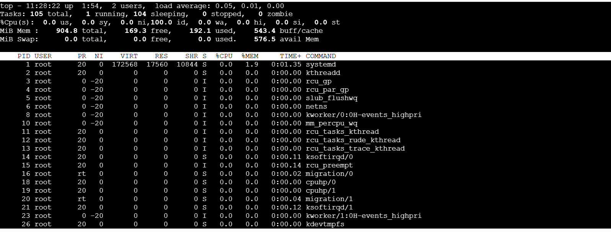

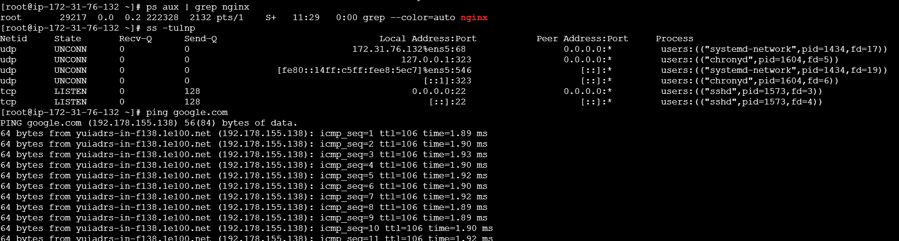

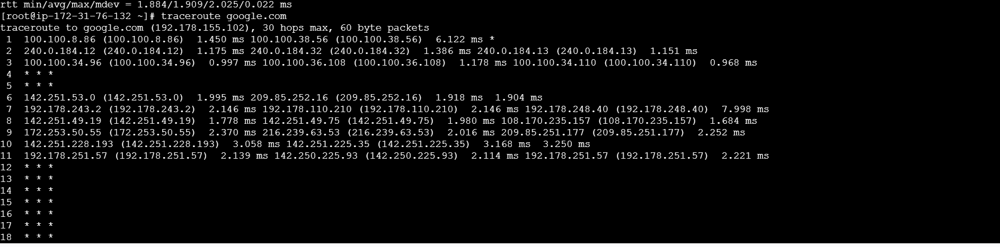

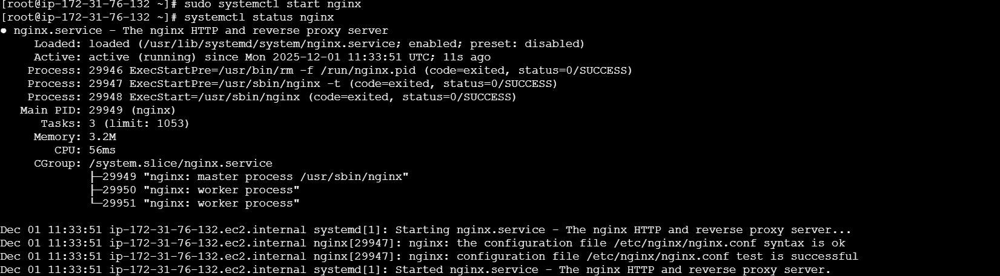

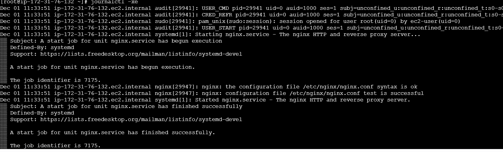

## Level 3 – Advanced (Production-Ready Linux Admin)

-  Create custom systemd service for your application

``` bash
Create the application start script
Use a simple script first; replace with your real command later.
sudo mkdir -p /usr/local/bin /var/log/myapp /etc/myapp
sudo nano /usr/local/bin/myapp.sh
Paste:
#!/bin/bash
# myapp.sh - example app starter
# Load environment variables if present
if [ -f /etc/myapp/myapp.env ]; then
  set -a
  source /etc/myapp/myapp.env
  set +a
fi

# Write a startup log line
echo "MyApp starting at $(date)" >> /var/log/myapp/myapp.log

# Example long-running process; replace with your real app
# e.g., java -jar /opt/myapp/app.jar
# or: /usr/local/bin/myapp-binary --port "$MYAPP_PORT"

# Keep process alive (simulate daemon). Replace with your app command.
while true; do
  echo "MyApp heartbeat at $(date)" >> /var/log/myapp/myapp.log
  sleep 60
done

Make executable:
sudo chmod +x /usr/local/bin/myapp.sh
Step 2: Write the systemd unit file
sudo nano /etc/systemd/system/myapp.service
Paste:
[Unit]
Description=My Custom App Service
After=network.target
# Optional: require network
Wants=network-online.target

[Service]
# The command to start your app
ExecStart=/usr/local/bin/myapp.sh
# Restart behavior
Restart=always
RestartSec=5

# Run as a dedicated user (recommended for security)
# Create user/group first: sudo useradd --system --no-create-home --group nogroup myapp
# Then set:
# User=myapp
# Group=nogroup
User=root

# Environment
EnvironmentFile=-/etc/myapp/myapp.env
# Logging to journal (view with journalctl)
StandardOutput=journal
StandardError=journal
# Hardening options (add gradually; may require tuning)
# NoNewPrivileges=true
# ProtectSystem=full
# ProtectHome=true
# PrivateTmp=true
# RestrictAddressFamilies=AF_INET AF_INET6
# CapabilityBoundingSet=CAP_NET_BIND_SERVICE
# AmbientCapabilities=CAP_NET_BIND_SERVICE

# Working directory if needed
# WorkingDirectory=/opt/myapp

[Install]
WantedBy=multi-user.target

Reload unit files:
sudo systemctl daemon-reload
Commands:
sudo systemctl start myapp
sudo systemctl enable myapp
sudo systemctl status myapp
```
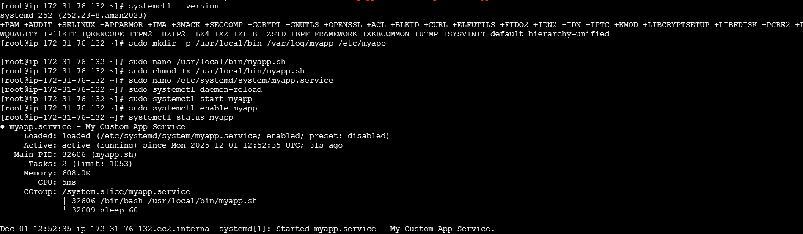

-  SSH hardening for security

``` bash
Explain key changes.

Commands:

Disable root login: sudo nano /etc/ssh/sshd_config
Set:
PermitRootLogin no
PasswordAuthentication no
port 2222
Restart SSH: sudo systemctl restart sshd
```


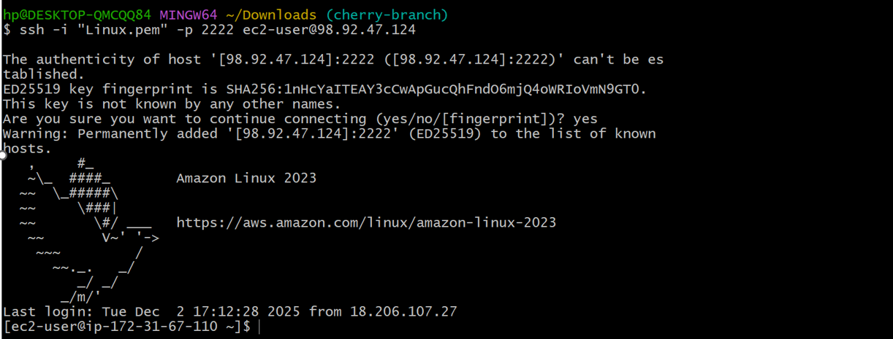

- LVM setup for storage scaling
``` bash
Step-by-step demonstration:

Check disks: 
lsblk
sudo fdisk -l
Create Physical Volume:
sudo pvcreate /dev/sdb
sudo pvs
Create Volume Group:
sudo vgcreate myvg /dev/sdb
sudo vgs
Create LV(Logical Volume):
sudo lvcreate -L 5G -n mylv myvg
sudo lvs
Format LV:
sudo mkfs.ext4 /dev/myvg/mylv
Mount LV:
sudo mkdir /data
sudo mount /dev/myvg/mylv /data
df -h
```
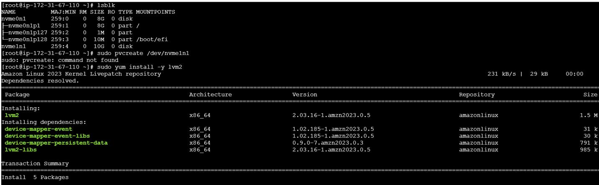
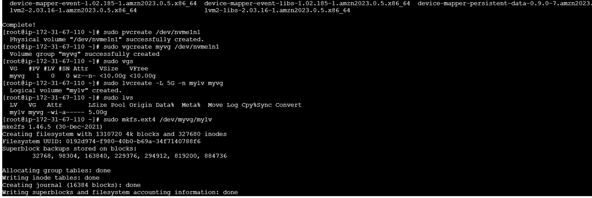
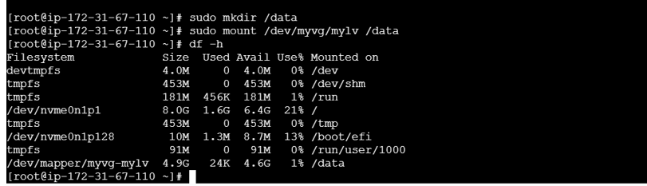

- Configure firewall rules
``` bash
For UFW:
sudo ufw allow 22
sudo ufw allow 80
sudo ufw allow 443
sudo ufw enable
sudo ufw status
For firewalld:
sudo firewall-cmd --add-service=http --permanent
sudo firewall-cmd --add-service=https --permanent
sudo firewall-cmd --reload
```
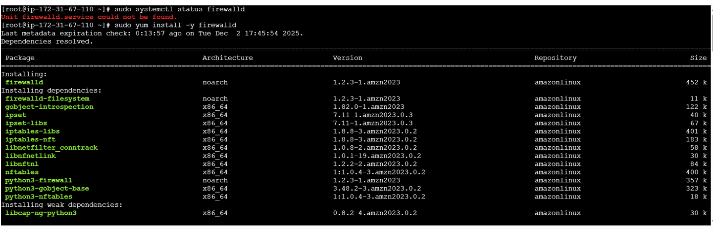

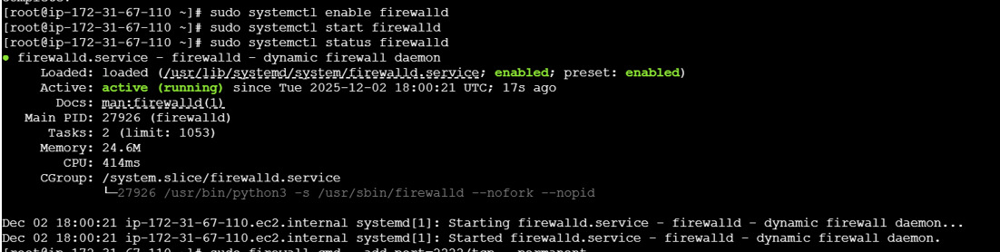

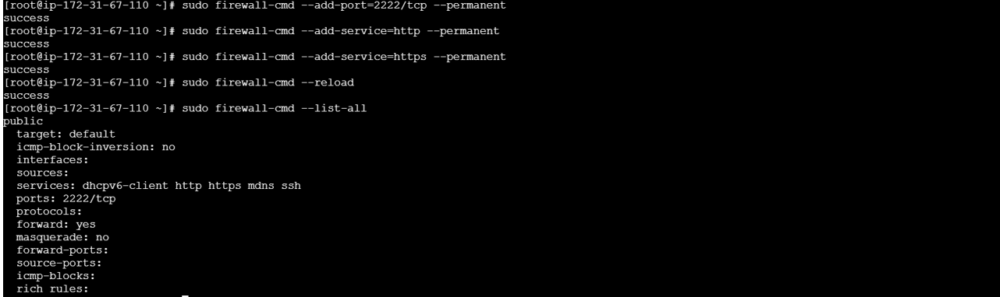

- Implement logrotate for app logs
``` bash
Create a config file:
sudo nano /etc/logrotate.d/myapp
Content:
/opt/myapp/logs/*.log {
    daily
    rotate 7
    compress
    missingok
    notifempty
}
Test logrotate:
sudo logrotate -d /etc/logrotate.conf
```

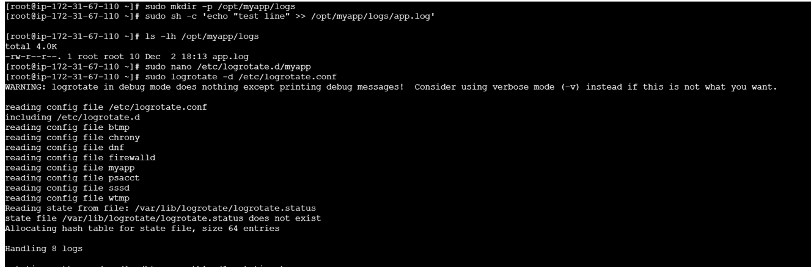


